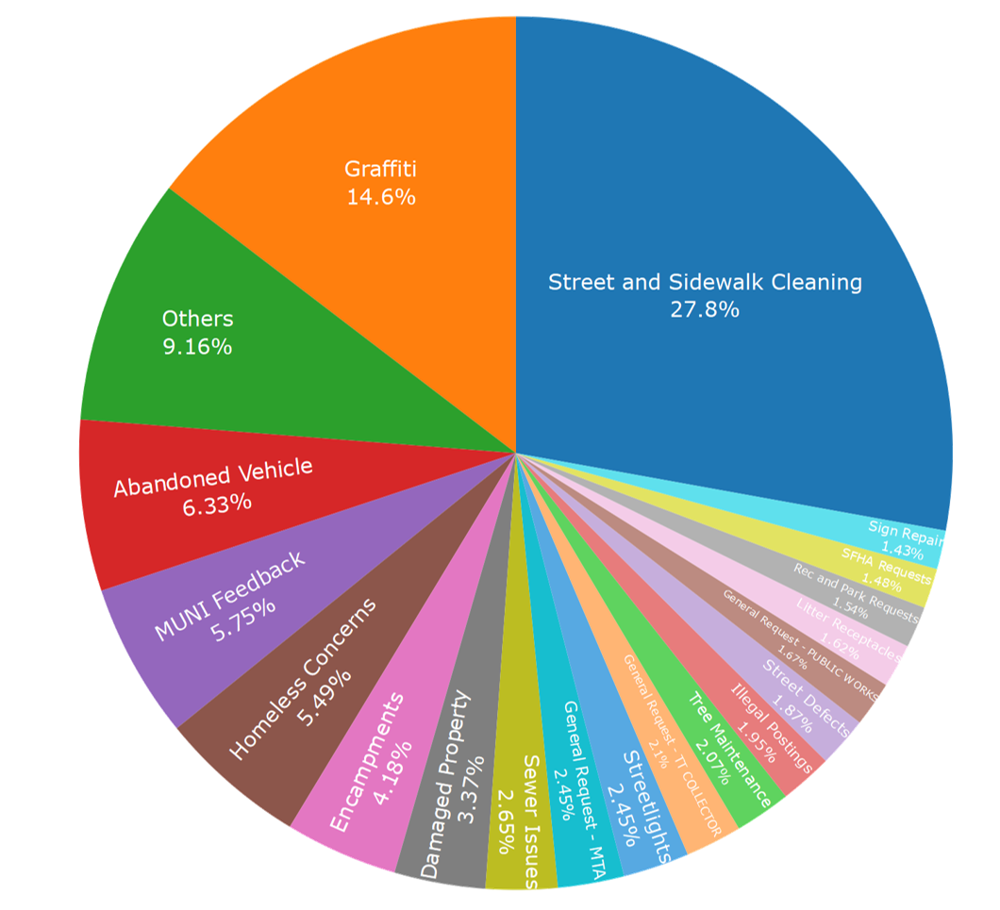
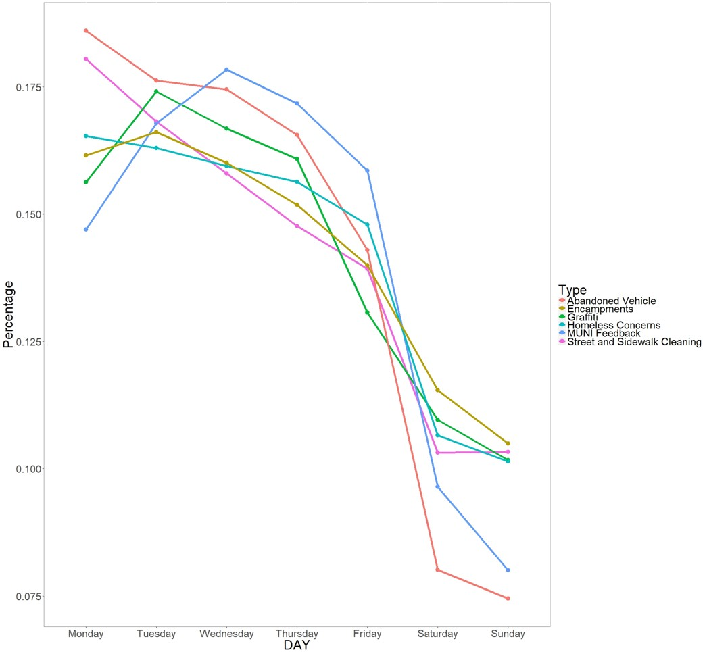
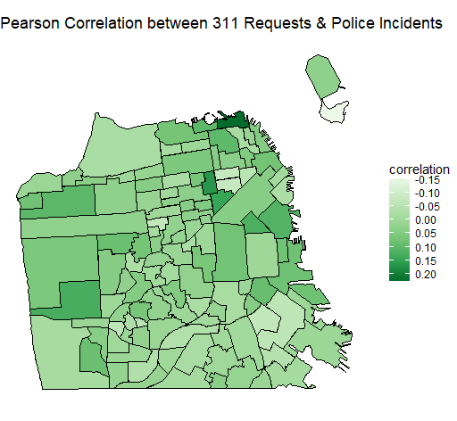
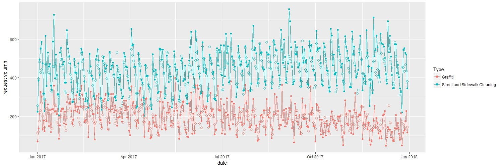

# Analysis and Prediction of 311 calls in San Francisco

Please find the presentation slides [here](https://www.slideshare.net/secret/NsQVaWTwWqWbQ5)

## Motivation

"311" is the toll-free number for non-emergency government communications. First piloted in Baltimore, Maryland in 1996, 311 systems have been adopted across United States to be a point of entry to all government information and to serve as one basis of the government performance metric. Citizens could request services, report non-emergency concerns, and obtain information about the city via phone call, email, twitter, or dedicated mobile apps, while government could use the requests to spot trends and anticipate future citizen needs. It is thus very important for the government to be able to forecast the request volumes of each type to reduce operation costs and to improve customer experiences by optimal investment in infrastructures and staffing decisions. 

With an enormous amount of data recorded by 311 system operators, I propose to build a day-ahead forecast model to predict the volumes of the requests of each type based on previous requests volumes and external factors such as weather, day of week, holiday, socioeconomic status of the population, and nearby police incidents. I deicide to split my project into two tasks: 

1. Influencing Factor Discovery: Spatial-temporal correlation study between complaints volume and other influencing factors 
2. Prediction Model Building: Day ahead prediction for complaints volumes of each complaint type based on their historical volumes and identified influencing factors

## Current Status for the Research

I have built a general framework for this research and tested it on two hypothesis I made. 

1. Higher 311 request volume indicates better access to the technology and may indicate more affluent neighborhoods with lower police incidents.
2. A random forest model with 12 features could be used for prediction.

This general framework is flexible enough to accommodate many more kinds of analysis than what I have shown in these two case studies with limited amount of time.

## Some Interesting Graphs

You can see the percentage of each complaint type in the pie chart above. Note that only the top 19 complaint types are displayed, the sum of the rest types is displayed as Others.

I plotted the request volumes of the top six complaint types distributed over days of the week. It is easy to see requests volume during the weekends are significantly smaller.

I wanted to analyze the Pearson Correlation between the total 311 requests volume and the total police incidents volume in different neighborhoods of San Francisco. However, the only common aggregated location indicator in the 311 and police incidents data set is the police district, which is too large for meaningful neighborhood analysis. The good news is that they both contain GPS coordinates for each record. I then downloaded a more granular neighborhood shapefile from SF Gov and categorized each record into the neighborhoods defined by the shapefile. 

After counting the total number of incidents in each neighborhood, I has two time series data set of the daily number of 311 requests and police requests in each neighborhood from 2012 to 2017. For the days when there is no police incident but there are some 311 requests, I have set the number of police incident to zero. 

I then carried out correlation analysis of these two time series and provided a heat map showing values of the correlation on different neighborhoods on SF map.

### Comparison between the predicted daily request of 2017 and the reality

The solid point shows the request volumes in the real data, and the circle represents the one from the prediction.

### Aggregated Prediction for Each Type of Requests from 2012 to 2017


I propose to predict the daily number of calls for the top most frequent 50 complaint types using random forest. 
To prepare for the features for prediction, external data sources will be used. They are US calendar and San Francisco historical weather data from NOAA. Both of them are downloaded from website.

From all the data, 12 features are created, including day of the week, national holiday, average temperature, temperature range, precipitation, and the request volume in previous 7 days. These features will be used to predict the request volume of each day. 

Both day of the week and national holiday are used as categorical features, where day of the week have 7 levels and the public holiday has 11 levels (10 for holidays and 1 for normal days). All the other features are daily numerical values. 

At last, the predicted request volume for each complaint type are plotted. 

## Preliminary Results and Plan for Future Research

For the correlation study, we could see that the in most neighborhoods, the correlations are not significant, which prompted me not to include the crime data in my prediction model. However, I believe further study need to be done to completely rule out this factor. For example, instead of using the existing geographical neighborhood, I could use cluster technique to group the location with similar characteristic. Also, I have now only considered the correlation between 311 requests and police incidents, it is very likely I could use this method to find more influencing factors to be used in the prediction model.

The R-square result for the prediction of the top 50 complaint type is plotted in the histogram, indicating that some of the random forest models give us good results, while some not. This indicates that common influencing factors among all complaint types may not be sufficient. It is necessary to find the most important influencing factor for each type complaints and build models based on these unique set of factors. I would like to add more factors like location and socioeconomic status of the population to the model to find the optimal sets of factors.

## Data Sources

|Data                                             | Source           | Access Method         |Size|
|  ---                                            |  ---             | ---                   |--- |
|San Francisco 311 Cases                          |data.sfgov.org    |    Api                |2.92M rows, 19 columns, 961MB|
|San Francisco Police Incidents                   |data.sfgov.org    |    Api                |2.2M rows, 13 columns, 442 MB|
|National Holiday                                 |US calendar       |Downloaded as csv      |60 rows, 3 columns, 3KB|		
|San Francisco Weather History                    | 	NOAA	     |Downloaded as csv      |0.2M rows, 23 columns, 9.5MB|
|San Francisco Blocks and Neighborhood Definition |	data.sfgov.org   |Downloaded as shapefile|172 KB|

